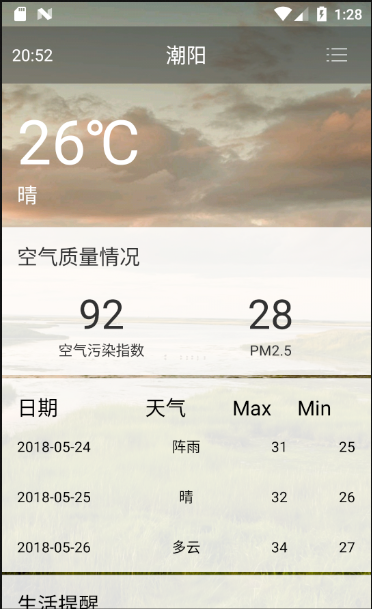
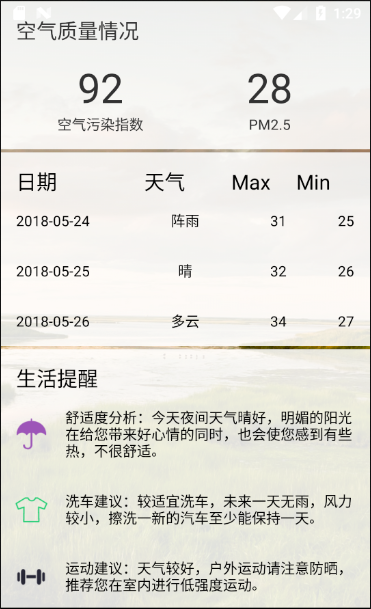
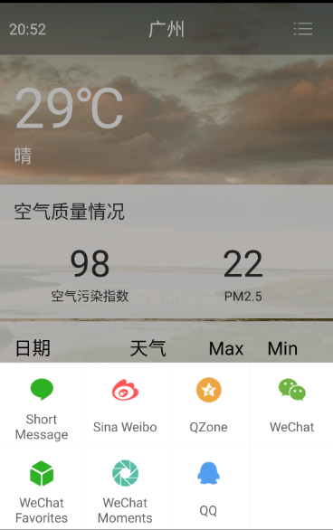

# GreenWeather

#### 简单的天气预报，拿来做Android开发课设
## 当前功能:

- 天气查询
- 切换城市
- 下拉刷新
- 共享
- 网页访问
- 实时更新

## 引用技术：
- Litepal搭建数据库
- OkHttp网络请求
- GSON解析JSON
- Sharepreferences数据缓存
- Service 后台服务
- ShareSDK 文件共享

